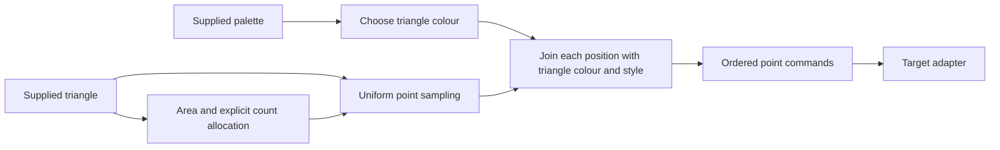

# Provisional API architecture

Status: written architecture direction, corrected by the [decision audit](audits/phase2-architecture-review.md).
Regular grid, gradient noise, cyclic palette and integrated gradient paths have reviewed
contracts and implemented Java, JavaScript and Python cores. CP1 FieldMarks and CP2
PathMarks have accepted native examples and local package consumers across Processing,
p5.js, py5 and Android in their recorded runtime scopes. Current support comes from the
checked [operation reference](reference/operations.md), not historical contract-freeze
status fields. Noise and integrated paths are explicitly admitted capability dependencies,
not whole-computation merges of their surveyed consumers. The [authored ledger](../design/phase2/cluster-decisions.json)
has 1,790 candidate records unresolved; candidate dispositions are separate from public
function counts. The 29 automated triage hypotheses are search aids, not an API inventory.

The architect's [artist capability direction](artist-capabilities.md) now controls priority
and public-surface admission. CP1 is an editable field of independent marks; CP2 challenges
its boundary with integrated paths. This document describes internal composition, not the
artist's required starting vocabulary. Cohesive public conveniences may compose these
layers when they remove meaningful wiring without hiding the artist's choices.

The historical [drawing-boundary proposal](../design/drawing-boundary.md) led to the
reviewed [fresh-raster drawing contract](../catalog/drawing/fresh-raster-2d.json) used by
the native examples. CP3 size-aware placement, CP4 quadrant partition, CP5 retained
triangle grain and CP6 endpoint branching are locally delivered on Java, with scoped native and visual validation.
The local0.6.0 archive includes six workflows and ten operations; target support is
recorded in the checked operation reference. Other ports remain deferred during the Java
breadth sprint. The [CP6 selection](../design/capabilities/cp6-branching-selection.md)
records the breadth-first ordering choice; the frozen catalog controls exact behavior.

CP7 now has a reviewed capability-dependency admission for a retained radial-profile
surface, following a seven-image private P3D comparison. Its proposed result includes
indexed triangles, local flat normals and face band/cell/kind, allowing profile edits and
retained styling without caller topology or normal reconstruction. See the
[CP7 selection](../design/capabilities/cp7-profile-selection.md) and
[admission review](../design/capabilities/cp7-ledger-admission-review.md). Contract and
implementation work remain; this is not an eleventh shipped operation. The source audit
also reopened prueba4's provisional merge because its longitudinal strips overlap.


## Public surface and composition

The proposed package has four layers. This separation is a design decision, informed by
compound helpers in the corpus; it is not a claim that those sketches already use this architecture.

| layer | responsibility | boundary |
|---|---|---|
| Portable operations | Compute positions, attributes, topology, state transitions or geometry | Explicit inputs/outputs, one defined computation, no host globals |
| Mark construction | Join geometry with explicit colour/style into ordered commands | No hidden sampling, palette choice, renderer state or asset loading |
| Target adapters | Consume commands and declared assets/capabilities | Processing Java, p5.js, py5 and Android validated independently |
| Recipes and templates | Convenient, recognizable pieces composed from operations | Preserve useful artistic assemblies without making each a new primitive |

A generator produces values from its inputs; a transform maps supplied values or advances
explicit state; a mark constructor produces commands; the adapter is the rendering sink.
The role follows a contract's actual inputs and outputs. Palette selection generates a
colour; it is not a point transform. Annular geometry should produce vertices/topology
before attribute assignment and rendering, subject to its unresolved tessellation review.

Composition is a dataflow graph, often with joins and explicit loops, not necessarily a
linear generator→transform→sink chain. For the delivered supplied-triangle grain workflow:



This graph shows data dependencies, not permission to reorder random calls. The
[puntis note](../survey/out/2018/Generativos/puntis/notes.md) describes choosing the
triangle stroke colour before its inner sampling loop. Source replay would need that shared-state order. CP5 deliberately owns independent
geometry streams so retained points survive style edits; it makes no source replay claim. Stochastic contracts must specify their complete stream and consumption. An operation
may own a private stream initialized from an explicit seed when independent replay is
its intended boundary; exposing raw state is not a universal requirement. Operations
that intentionally share a stream must specify its ownership and returned state.
Stateful updates also expose time, history and occupancy
where relevant. Introduce no universal environment object containing unused dependencies.

Public operations use one named parameter object, portable value inputs and explicit
results/errors. Use computation names and consistent units; final language spellings,
data schemas and defaults belong to the catalog contract. No arbitrary host callback
stands in for an unspecified portable split, integration or sampling rule. A small number
of named strategies is possible only after each strategy's semantics and fixtures exist.
Native examples can use ordinary loops and function calls; a persisted recipe graph and
executor are later deliverables with their own schema and validation prerequisites.

## What must be separated before contracts

| investigation | unresolved distinction | evidence |
|---|---|---|
| Layout and subdivision | Binary cut, four-way rectangle split, variable grid refinement; child construction versus leaf scheduling and jitter | [lavita03](../survey/out/2019/generativos/lavita03/notes.md), [chinasseForms](../survey/out/2017/Generativos/chinasseForms/notes.md), [mosaic02](../survey/out/2018/Generativos/mosaic02/notes.md) |
| Grid transforms | Snapping, alternating offset, jitter and reflection are distinct computations | [giragira](../survey/out/2018/Generativos/giragira/notes.md); ledger `layout.grid-transform` remains a family |
| Fields and paths | Independent field-oriented strokes, finite feedback integration, persistent 3D agents | [pelines](../survey/out/2018/Generativos/pelines/notes.md), [pelolos002](../survey/out/2018/Generativos/pelolos002/notes.md), [pelines3d002](../survey/out/2018/Generativos/pelines3d002/notes.md) |
| Lattice walks | Neighbour topology, occupancy, retry limits and early termination | [tata](../survey/out/2019/generativos/tata/notes.md), [guagua](../survey/out/2019/generativos/guagua/notes.md) |
| Colour | Entry selection, cyclic interpolation, explicitly positioned stops, random HSB construction | [triangulitos](../survey/out/2015/Generativos/triangulitos/notes.md), [colorRamp](../survey/out/2016/Generativos/colorRamp/notes.md), [rosita](../survey/out/2016/Generativos/rosita/notes.md) |
| Sampling and marks | One uniform triangle point versus density/count allocation, colour and point rendering | [puntis2](../survey/out/2018/Generativos/puntis2/notes.md), [puntis3](../survey/out/2018/Generativos/puntis3/notes.md) |
| Typography | Portable placement and cell selection versus glyph metrics, font assets and rendering | [textureGridText](../survey/out/2016/Generativos/textureGridText/notes.md), [numbers](../survey/out/2018/Generativos/numbers/notes.md) |
| Mesh and raster | Geometry/topology versus per-vertex attributes; pixel operations versus command transforms | [cilindros](../survey/out/2017/Generativos/cilindros/notes.md), [gridsCircles](../survey/out/2015/Generativos/gridsCircles/notes.md) |

The module vocabulary remains `layout`, `sampling`, `field`, `path`, `topology`, `geometry`,
`mesh`, `color`, `motion`, `mark`, and capability-bound raster/text adapters. Allocate a
function to the module owning its computation; do not duplicate it under every idiom.
Keep tiny arithmetic helpers internal unless independent public use warrants them.
The former 30–80 estimate is not a delivery quota. Count conveniences as public surface too.
Do not force a count by merging different algorithms, or fragment a usable
operation into a dozen trivial public calls.

## Architecture acceptance through real compositions

The optional triangle slice can test a small dependency chain across four targets. It cannot
establish artist usefulness. Prioritize CP1 and its CP2 boundary check; select subsequent
capabilities deliberately. Before claiming coverage of any of the following compositions,
trace it through concrete operation contracts. The following
are proposed acceptance cases, not completed reproductions or promises of exact pixels.

| case and motivation | values and composition to demonstrate | currently missing |
|---|---|---|
| Grid/noise strokes — [pelines](../survey/out/2018/Generativos/pelines/notes.md) | Grid positions → sampled angle/length/colour → clamped segments → marks | Grid, field and clipping boundaries; avoid unnecessary path integration |
| Flow and marks — [ciserp](../survey/out/2019/generativos/ciserp/notes.md) | Ordered integrated positions → perpendicular strokes/end marks, with explicit progress attributes | Integration versus envelope/style extraction; state and order contracts |
| Scattered triangulated forms — [puntis](../survey/out/2018/Generativos/puntis/notes.md) | Sites → triangulation → per-triangle colour/count → point samples → marks | Site generation and topology beyond the micro-slice; density and RNG order |
| Branching — [Arboles](../survey/out/2014/Generativos/Arboles/notes.md), [arbolito4](../survey/out/2018/Generativos/arbolito4/notes.md) | Parent segments → ordered child geometry → taper/marks | Recursion, termination and resource semantics; distinguish shared-pool line cutting |
| 3D — [cilindros](../survey/out/2017/Generativos/cilindros/notes.md) | Supplied radial profile → rings/topology → vertex attributes → mesh commands | Caps, seams, winding, coordinates and four-target rendering |
| Typography — [textureGridText](../survey/out/2016/Generativos/textureGridText/notes.md) | Cells/placement records + supplied glyph/font data → text commands | Portable layout decision independently of font capability |

For each case, record which concrete operation consumes each value, ownership, units,
state order, commands, capabilities and success criterion. A missing join, arbitrary
callback, hand-coded reimplementation of the proposed reusable algorithm, or silent
renderer fallback is an architecture issue to resolve. Artistic parameter choices and
ordinary glue code are expected in recipes. Examples must remain short enough to teach
an idiom; separation alone does not guarantee usability.

Rare families stay visible: flow and Delaunay are retained investigations; the single
physics report [araniaaas](../survey/out/2018/Generativos/araniaaas/notes.md) supports
spring-state work, with time/ranges unresolved. The L-system-labelled
[brotes](../survey/out/2019/generativos/brotes/notes.md) supports stochastic line-pool
subdivision, not a general grammar engine. Typography placement is in scope for review;
font capability gaps do not reject it. No rare family is excluded wholesale here. The
missing 75 reports cannot establish family absence.

## Contract admission and excluded wrappers

Every family must become a narrowly defined operation candidate before its contract is
prepared. Record reviewed inputs, outputs and invariants, no unresolved architecture
questions, and an audit of every retained member. An extraction also accounts for the
remaining components. Resolve or explicitly rescope associated unresolved records.

```sh
uv run python tools/check_phase2_design.py --contract-cluster sampling.point-in-triangle
```

This currently fails intentionally because the architecture is pending. Passing it checks
recorded prerequisites; it does not prove semantic equivalence or approve a contract.
The operation-contract skill still requires numeric/error semantics, adequate parameter
evidence, capabilities and distinguishing fixtures. Review related unresolved candidates
outside the cluster as well; a validator cannot detect a misleading manual reassignment.

The 18 remaining wrapper exclusions have explicit component destinations in the ledger;
see the [rejection review](audits/phase2-rejection-review.md). Faceted discs, crowds,
posters and similar assemblies remain valuable example/template work. Deferred components
are outstanding work, not proof that existing operations already cover them. There is no
blanket exclusion of faces, trees, HUDs, text or any technique by visual name.
