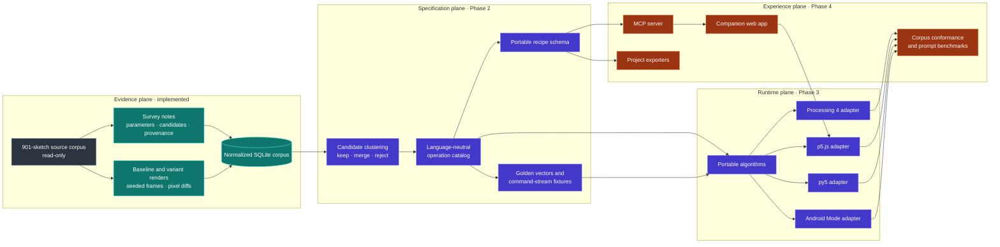
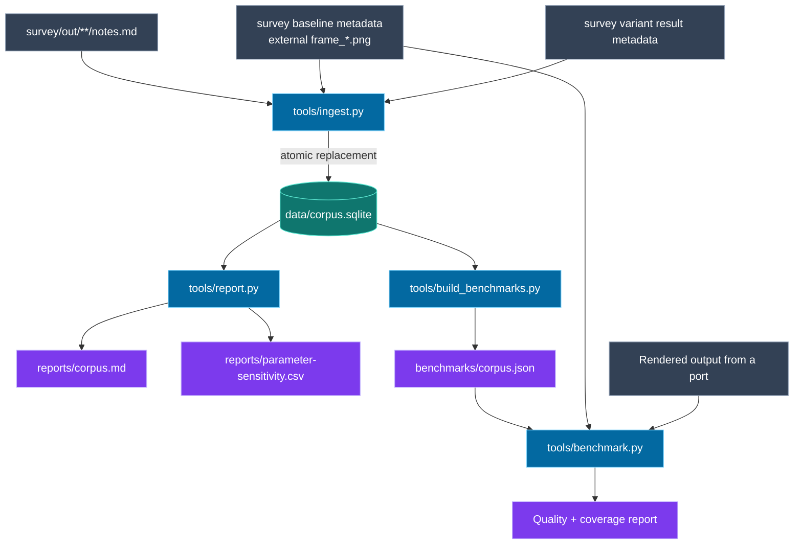
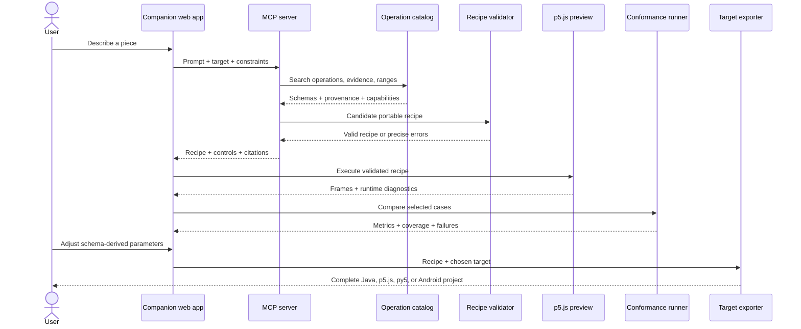
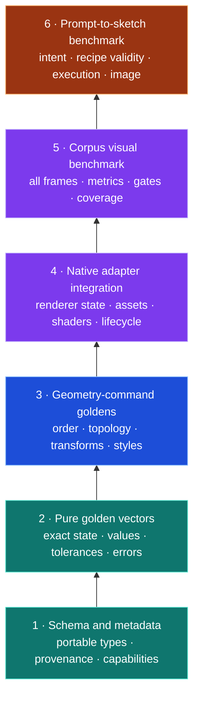
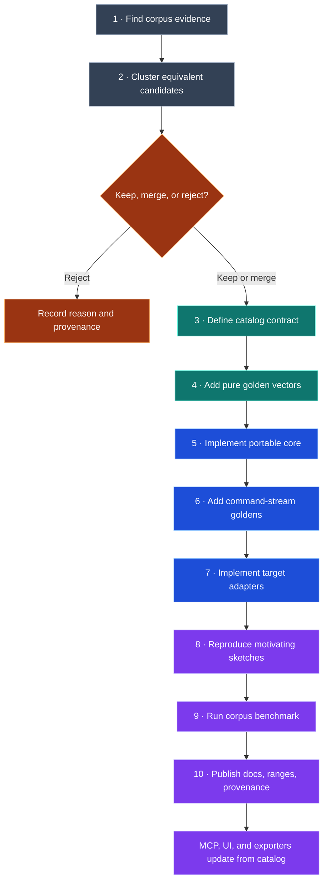

# Procedurals

## Architecture and contributor guide

Procedurals is an evidence-backed generative-art toolkit being distilled from a survey of 901 Processing sketches. Its purpose is not to collect hundreds of copied helpers. It is to identify a small, composable vocabulary of generators, transforms, and rendering operations whose behavior, useful parameter ranges, and provenance are all measurable.

Processing 4 is the reference implementation. The behavioral contract is language-neutral so the same operations and recipes can be implemented in p5.js, py5, and Processing for Android. A future MCP server and companion web application will turn natural-language prompts into validated portable recipes, preview them with p5.js, and export projects for every supported target.

> **Current status:** corpus ingestion, analysis, visual benchmarking, and reference-form validation are implemented. The operation catalog, public drawing library, recipes, target adapters, MCP server, and web application are planned. They remain gated until the full survey is complete. Read `PROJECT_STATE.md` before contributing.

---

## The project in one diagram



The architectural boundary that matters most is between the **portable behavioral specification** and the **host renderer adapters**. Java is first because the evidence corpus is Processing, but Java classes and Processing globals must not become the specification by accident.

---

## Four constituent parts

### 1. Evidence and corpus tooling

This is the implemented foundation. It turns a growing directory of Markdown notes and rendered images into data that can support API decisions.



Key properties:

- Upstream source sketches are provenance and remain outside this repository.
- Ingestion is idempotent across published survey snapshots.
- Raw frontmatter is preserved alongside normalized fields and explicit normalization records.
- Every parameter and reusable candidate has a provenance path back to its note.
- Malformed records are recovered where possible and diagnosed; they are not silently lost.
- Sensitivity measurements are primary API evidence. A repeatedly inert parameter is evidence against exposing it.

Start with:

- `tools/ingest.py` — parser, normalization, SQLite schema, baseline and variant ingestion.
- `data/corpus.sqlite` — queryable evidence store and provenance views.
- `tools/report.py` — corpus associations, candidate distribution, and parameter sensitivity.
- `reports/corpus.md` — readable snapshot of the current evidence.
- `reports/parameter-sensitivity.csv` — complete parameter-level analysis input.

### 2. Language-neutral specification

This is the planned center of the product. Phase 2 will cluster near-duplicate candidate proposals by what they compute, then make an explicit keep, merge, or reject decision for each cluster.

The resulting operation catalog will describe every public operation once:

| concern | catalog responsibility |
|---|---|
| Identity | Stable operation identifier and semantic version |
| Composition | Generator, transform, or sink role |
| Data | JSON-compatible input and output schemas |
| Behavior | Coordinates, angles, ordering, mutation, errors, and degenerate cases |
| Numerics | Rounding, interval rules, colour encoding, and field-specific tolerances |
| Environment | Explicit RNG, noise, time, assets, pixel density, and capabilities |
| Evidence | Motivating notes and measured useful parameter ranges |
| Portability | Supported targets and adapter requirements |
| Verification | Pure, command-stream, adapter, and visual fixture identifiers |

Conceptually, operations fall into three roles:


These are architectural roles, not finalized class names or signatures. Phase 2 owns those decisions after the complete corpus is available.

### 3. Reference implementation and target adapters

The portable core must not read Processing or browser globals. Randomness, noise, clocks, assets, canvas settings, and renderer capabilities are explicit inputs. Core values must be representable in JSON or canonical geometry/command buffers.

| target | responsibility | important constraints |
|---|---|---|
| Processing 4 | Reference implementation and desktop renderer adapter | JAVA2D/P2D/P3D behavior and corpus reproduction |
| p5.js | Primary browser adapter and web preview runtime | JavaScript numeric semantics, Canvas2D/WebGL, asynchronous fonts/assets, browser shaders |
| py5 | Python-facing port or thin JVM adapter per module | Python value semantics, JVM conversion, py5 state and headless execution |
| Processing for Android | Android-compatible Java core and renderer adapter | No AWT/Swing, Android lifecycle/assets, touch, density, OpenGL ES, context loss |

A host-specific convenience API may wrap the portable contract. It may not change operation semantics. Unsupported capabilities produce explicit results rather than silent fake fallbacks.

### 4. Recipes, MCP, and the web application

A recipe is a declarative, JSON-serializable composition of catalog operations plus its explicit environment: seed, canvas, time/animation inputs, assets, and target capabilities. It contains no arbitrary Java, JavaScript, or Python.

The MCP server and web app consume the same operation catalog as the runtime ports:



One catalog must drive MCP schemas, documentation, UI controls, validation, and exporters. Hand-maintaining parallel descriptions would allow them to drift.

---

## Verification architecture

Visual similarity alone is too ambiguous for fast, reliable ports. Procedurals uses progressively broader conformance layers.



The visual runner records dimensions, exact SHA-256 equality, RGB mean absolute error, changed-pixel fraction, block SSIM, histogram intersection, edge similarity, difference-hash distance, aggregate score, and coverage. Missing required renders fail; a port cannot pass by reporting only its easiest cases.

Read `docs/portability.md` for metric definitions and acceptance profiles. Read `docs/mcp-web.md` for the prompt benchmark and server/web boundary.

---

## Repository map

### Implemented now

```text
AGENTS.md                         Project mission, constraints, and phase gates
PROJECT_STATE.md                  Resumable checkpoint; read first

docs/
  architecture.md                This guide
  target-form.md                 Reference-form decision and trade-offs
  portability.md                 Cross-language architecture and conformance
  mcp-web.md                      MCP, recipe, prompt, and web-app requirements

tools/
  ingest.py                      Notes/results -> normalized SQLite
  report.py                      SQLite -> corpus and sensitivity reports
  sync_survey.py                 Publishable survey snapshot refresh
  build_benchmarks.py            SQLite/baselines -> visual manifest
  benchmark.py                   Port renders -> objective benchmark result

data/corpus.sqlite               Current queryable corpus snapshot
reports/                          Generated analysis artifacts
benchmarks/corpus.json            Current all-frame visual benchmark manifest
benchmarks/schema.json            Manifest contract
survey/                          Reports, result metadata, methodology, provenance
tests/                            Ingestion and benchmark contracts
```

### Planned after the Phase 2 gate

- Operation catalog and its schemas.
- Portable core algorithms and canonical command representation.
- Processing 4, p5.js, py5, and Android adapters.
- Recipe schema, validator, and exporters.
- Pure and command-stream conformance fixtures.
- MCP server and generated tool/resource schemas.
- Companion web application with p5.js preview.
- Corpus-backed prompt benchmark.

No planned path or class name is authoritative until Phase 2 records the API design.

---

## Contribution workflow

### Before any change

1. Read `PROJECT_STATE.md` for the current phase and survey status.
2. Read `AGENTS.md` for hard constraints and phase gates.
3. Identify whether the work changes evidence tooling, a future public operation, a recipe, a target adapter, or a product surface.
4. Follow provenance back to checked-in survey notes and externally stored images. Do not
   invent visual behavior absent from the corpus.
5. Preserve the upstream source corpus's authorship and MIT notice.

### Adding a new function or operation

Do not add public drawing operations before Phase 2 opens. Once it does, use this lifecycle:



Detailed checklist:

1. **Establish evidence.** Query candidate proposals, technique associations, parameter sensitivity, and relevant notes. Cite every motivating sketch.
2. **Cluster by computation, not name.** Compare what candidates calculate and emit. Similar names may differ; different names may be identical.
3. **Make the explicit decision.** Record keep, merge, or reject. A one-off aesthetic choice is not a library function.
4. **Define the portable contract.** Assign its role; specify JSON-compatible inputs/outputs, ordering, mutation, numeric rules, degenerate cases, errors, capability requirements, and deterministic behavior.
5. **Select parameters from evidence.** Prefer parameters repeatedly producing moderate or large change. Explain any deliberate divergence from corpus evidence.
6. **Add pure fixtures first.** Include normal values, measured boundaries, fixed seeds, consecutive RNG states, empty/degenerate inputs, and invalid inputs. Use per-field tolerances.
7. **Implement without host leakage.** The core must not import Processing, p5, py5, AWT/Swing, Android UI, or browser types.
8. **Add command fixtures.** Assert command order, topology, counts, transforms, colours, and style state before rasterization.
9. **Implement adapters.** Cover Processing, p5.js, py5, and Android where capabilities permit. Otherwise record an explicit unsupported capability.
10. **Reproduce motivating work.** Rewrite representative surveyed sketches using the operation, including relevant renderers and animated frames.
11. **Benchmark.** Run pure, command, adapter, and visual suites. Missing required cases are failures.
12. **Document.** Publish semantics, observed-useful ranges, examples, limitations, target support, and provenance. Catalog-driven MCP/UI/export artifacts must remain synchronized.

### Adding a recipe

A recipe is accepted only when it demonstrates composition of existing operations; it is not a place to hide new unreviewed algorithms.

1. Identify the corpus composition or idiom being represented and cite its motivating sketches.
2. Choose only cataloged generators, transforms, and sinks.
3. Declare seed, dimensions, renderer/capabilities, assets, animation/time behavior, and pixel-density expectations.
4. Keep every value JSON-serializable and validate the recipe schema.
5. Verify all parameter values against measured ranges or document why the recipe intentionally exceeds them.
6. Execute through the reference adapter and every supported target adapter.
7. Store canonical command output where applicable.
8. Render every required frame and run the visual benchmark.
9. Add the recipe to documentation, examples, MCP resources, and web discovery through catalog metadata—not duplicated hand-written schemas.
10. Confirm exported projects replay the same recipe rather than translating it into semantically different host code.

### Adding or extending a target port

1. Consume the shared catalog and fixtures unchanged.
2. Implement pure operations until golden vectors pass.
3. Implement canonical geometry/command emission until command goldens pass.
4. Add the smallest native adapter over the target renderer.
5. Test renderer state, colour modes, transforms, assets, fonts, shaders, density, and lifecycle in the actual runtime.
6. Render candidates at `<candidate-root>/<sketch>/frame_NNNNN.png`.
7. Run `tools/benchmark.py` with the correct target identifier.
8. Report full coverage, failures, and unsupported capabilities. Do not average away missing cases.

### Adding a prompt-to-sketch case

Prompt cases begin only after the catalog and recipe schema exist.

1. Derive the prompt from a surveyed idiom or an intentional composition of retained operations.
2. Define required and forbidden techniques, target capabilities, canvas/animation requirements, parameter predicates, and provenance requirements.
3. Allow semantically equivalent recipes; do not assert one exact syntax tree.
4. Validate deterministic protocol behavior with a recorded planner output or fixed local-model configuration.
5. Execute the recipe in the requested target.
6. Score recipe validity, prompt intent, execution, cross-target semantics, visual result, and coverage separately.
7. Include dominant clusters and retained rare families; do not let grid/noise prevalence erase flow fields, Voronoi/Delaunay, physics, L-systems, or typography.

---

## Running the implemented tooling

Rebuild the current evidence and benchmark manifest:

```sh
uv run python tools/ingest.py
uv run python tools/report.py
uv run python tools/build_benchmarks.py
```

Run the contract tests:

```sh
uv run python -m unittest discover -s tests -v
```

Evaluate a port's rendered candidates:

```sh
uv run python tools/benchmark.py \
  --candidate-root path/to/rendered-cases \
  --target p5js
```

Valid target identifiers are:

- `processing-java`
- `p5js`
- `py5`
- `processing-android`

Use `--match` for a development subset. A release claim must run the complete manifest.

---

## Definition of done

A contribution is complete when its observable contract is present end to end:

- evidence and provenance recorded;
- portable schema and semantics defined;
- pure and command-stream fixtures passing;
- reference implementation complete;
- supported adapters complete in their native runtimes;
- unsupported capabilities explicit;
- motivating reproductions rendered;
- objective visual quality and coverage reported;
- documentation and useful parameter ranges published;
- recipe, MCP, web, and export surfaces synchronized from the shared catalog where applicable;
- no obsolete aliases, duplicated schemas, hidden host globals, or untracked behavior remain.

The governing principle is simple: **the corpus supplies evidence, the catalog supplies meaning, adapters supply pixels, and conformance keeps every language honest.**
