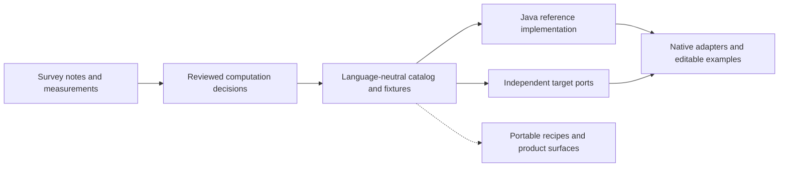

# Architecture

Procedurals turns survey evidence into composable generative-art operations and editable
native workflows. This page describes system boundaries. For current delivery/support,
read [PROJECT_STATE](../PROJECT_STATE.md); for work rules, read [AGENTS](../AGENTS.md).

## Evidence, specification and execution

The evidence and library paths exist. General portable recipes and MCP/web remain
[downstream work](roadmap.md); a [Java recipe prototype](java-recipe-preview.md) has a
narrow experimental scope. The diagram does not imply equal support on every target.

- **Evidence:** checked-in notes and render metadata are ingested into a provenance-linked
  SQLite database. Generated reports expose candidate computations, parameter sensitivity
  and reliability warnings. Full reference images are external inputs, not Git assets.
- **Specification:** the catalog records operation identity/version, portable values,
  ordering, ownership, errors, numerics, environment, capabilities and motivating evidence.
  Shared fixtures define expected results. Authored decisions remain distinct from generated
  suggestions; frozen historical status prose is not current support authority.
- **Implementations:** portable cores compute values, geometry or state without host globals.
  Renderer adapters handle commands, fonts, images, assets and lifecycle. Native convenience
  APIs may wrap the contract but must not silently change its semantics.
- **Composition:** examples join and iterate retained values, independently choosing layout,
  content and styling. Ordinary artistic drawing is appropriate; an unspecified host callback
  cannot stand in for a missing portable algorithm. See [API boundaries](api-design.md) and
  [composing Java effects](composing-java-effects.md).

## Target boundaries

| Target | Responsibility and constraints |
|---|---|
| Processing Java | Reference core and desktop JAVA2D/P2D/P3D adapters; renderer-specific evidence |
| p5.js | Browser execution; JavaScript numeric semantics, Canvas/WebGL and asynchronous assets |
| py5 | Python values and JVM/native drawing integration; explicit conversion and lifecycle |
| Processing Android | Android-compatible core; no AWT/Swing, explicit assets/density and context restoration |

Current acceptance lives in `catalog/validation/` and bound root reviews. Unsupported
capabilities are explicit; compilation, mocks and another platform's images do not establish
native behavior. Historical package reviews describe their exact archived artifacts.

## Verification layers

Use the narrowest applicable checks before broader execution:

1. Catalog/schema, source provenance and capability bindings.
2. Pure fixtures for values, state, errors, ordering and numerical semantics.
3. Geometry/command checks for topology, transforms, styles and ownership.
4. Actual native adapter execution for renderer/assets/lifecycle and meaningful artist edits.
5. Declared visual reproduction profiles and measured coverage.

Full-corpus certification is separate from scoped capability acceptance. Missing required
frames and unsupported cases cannot disappear from its denominator. Prompt-to-recipe
quality will add intent and semantic-composition evaluation; it is not implemented evidence.

## Future recipe and product boundary

A portable recipe is intended to compose catalog operations with explicit seed, canvas,
time, assets and capabilities, without arbitrary host-language code. The catalog must drive
validation, reference, MCP metadata, web controls and exports. Parallel handwritten operation
schemas would create competing authorities.

The desired user flow is describe or compose a piece, validate it, preview/edit in p5.js,
and export for supported targets. The [MCP/web requirements](mcp-web.md) define that broader
objective. Freeze each implementation slice before coding and use the existing recipe and
catalog-synchronization skills; no draft architecture grants runtime support.

For contribution workflow use [agent briefs](agent-briefs.md). For evidence regeneration
use [survey documentation](../survey/README.md); for artist rendering use
[rendering Java](rendering-java.md). This page intentionally does not duplicate their commands.
